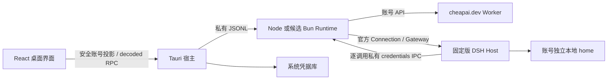

# 桌面架构

React 使用自有蓝白布局，并挂载 DSH 的公开 Remote contribution、SessionEventStream、AssistantStreamAccumulator 与消息基础组件。它不实现第二个 Agent、流式 mux 或持久历史引擎。全局会话状态事件配合会话列表基线提供任务计数；每会话 control stream 不能冒充全局状态。

Tauri 拥有 Runtime 进程、目录选择、固定网站入口、系统凭据持久化和标准 updater。侧车控制通道 bootstrapped 与 DSH ready 分开，因此没有登录时也能调用账号命令。私有 Cookie、Origin、Token 和 Key 不进入公开状态；页面调用的 decoded RPC 经过端点白名单、世代与请求关联校验。

Runtime 持有账号客户端、Token/Key 生命周期管理器和 DSH 启停。登录先返回私有 Token 给宿主，宿主保存后才发送 restore 激活账号。账号 ID 经散列选取 home；开发与生产分别命名。账号改变前停止旧服务并关闭旧 bridge/transport。静态 Key 配置只能在显式开发模式使用，生产使用逐模型调用解析的托管 credential reference。

DSH 是工具执行、会话、投影、等待问题与取消语义的所有者。桌面通过固定版 `ClientRemoteService.openRemoteStream` 载体接入 Gateway，该点需随 DSH 版本维护；公开客户端贡献保持上游数据语义。重连和重启不重放模型请求。

Worker 管理 opaque 桌面 Token、原子绑定的独立 Key、余额/账号投影与撤销。客户端重启或重复获取不能提前轮换 Key。生产 TTL 不为测试缩短。

安装资源只读，随包包含应用、Runtime、DSH 与所需生产依赖。用户历史与偏好位于用户数据目录，不依赖构建机 pnpm 缓存。具体固定版本见 `scripts/desktop/runtime-versions.json`；打包资源 hash 与源码提交见随包发行清单。

退出和安装更新前，已知运行任务或尚未完成任务基线同步的就绪 DSH 均需要确认。更新先停止自有 DSH 和整个 Runtime，完成有界进程树收尾后调用标准 updater；SDK 成功返回后退出应用，不重启或重放会话。更新失败后可显式重启本地服务。

自然 Token 到期只撤销新凭据解析并清除 Runtime 的敏感缓存；已开始的流继续使用已有请求。失效后保留的旧绑定，仅在新的凭据通过账号验证后关闭 bridge/child 并绑定新凭据。原生进程树收尾使用绑定 epoch/generation 的自有 PID/PGID，尚没有 OS job object/pidfd 绑定，也未经过目标机验证。
