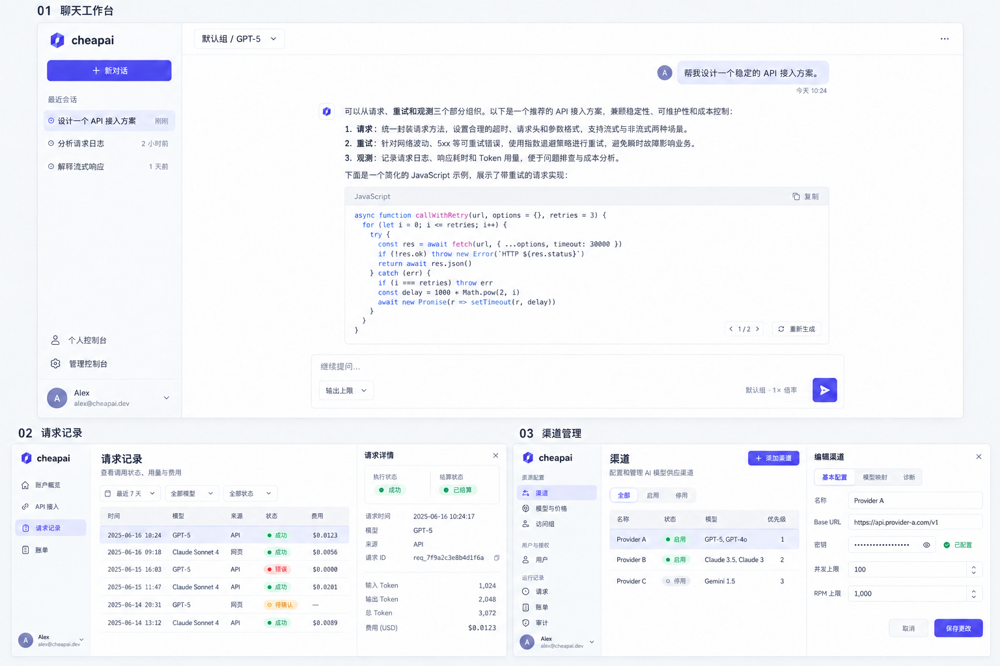

# cheapai React 前端重构设计

状态：设计方向已确认，React 已切换到正式 `apps/web`，本地验收完成。模块交付和验证摘要见[开发计划的当前进度](frontend-react-development-plan.md#当前实现进度2026-10-03)，逐项结果与边界见[最终集中验证报告](validation/cheapai-react-final.md)。

品牌决策：产品名称统一使用小写 **cheapai**。新版所有用户可见位置，包括 Logo 字标、导航、页面标题、登录注册页、空状态、接入示例和示例邮箱，均使用 cheapai，不出现旧产品品牌。示例邮箱统一为 `alex@cheapai.dev`。沿用已认可的靛蓝几何图标与浅色界面风格。

已认可的视觉方向：聊天工作台、请求记录与渠道管理三屏。品牌修订稿：



图片用于视觉参考，文字与数据为示例。

执行拆分见 [cheapai React 开发计划](frontend-react-development-plan.md)：实现任务限制写集，必要测试编写独立分派，测试与验证按完整模块集中执行。

## 1. 产品结构与范围

前端由三个工作区组成：聊天工作台、个人控制台、管理控制台。共用身份、设计规范与基础组件，分别采用适合任务的导航和布局。

- 聊天工作台：模型选择、对话、会话历史、回答版本、流式操作与恢复。
- 个人控制台：账户概览、API 接入、请求记录、账单。
- 管理控制台：渠道、模型与价格、分组、用户与授额、全局请求、账单与结算、注册策略、审计。
- 身份页面：登录、注册、邮件验证码、会话暂不可用、无权限、404。

首期覆盖现有业务能力。支付、OAuth、文件上传、语音、工具调用 UI、组织与多角色权限不列入本次迁移。未有接口的分析功能作为明确的后续任务，不在上线页面显示虚构数据。

## 2. 信息架构与路由

保留主要现有 URL，降低书签、会话回跳及测试迁移成本。聊天首页允许匿名浏览输入入口，发起业务操作前按现有认证规则登录。

| 工作区 | 路由 | 面板 |
| --- | --- | --- |
| 聊天 | `/`、`/chat/:id` | 新会话、历史对话 |
| 个人 | `/dashboard` | 账户概览 |
| 个人 | `/keys` | API 接入：密钥与接入说明 |
| 个人 | `/requests`、`/requests/:id` | 请求列表与详情 |
| 个人 | `/billing` | 账单 |
| 管理 | `/admin` | 首期跳转渠道管理；分析接口完成后再引入运营概览 |
| 管理 | `/admin/channels`、`/admin/channels/:id` | 渠道列表与配置详情 |
| 管理 | `/admin/models`、`/admin/models/:id` | 模型目录、价格与渠道映射 |
| 管理 | `/admin/groups`、`/admin/groups/:id` | 访问组与关联规则 |
| 管理 | `/admin/users`、`/admin/users/:id` | 用户详情、授权、余额操作 |
| 管理 | `/admin/requests`、`/admin/requests/:id` | 全局请求与排障 |
| 管理 | `/admin/billing` | 全局账单及相关结算入口 |
| 管理 | `/admin/registration/settings`、`/admin/registration/codes` | 注册策略与邀请码 |
| 管理 | `/admin/audit` | 审计记录 |
| 身份 | `/login`、`/register`、`/session-unavailable`、`/forbidden` | 身份与异常状态 |

渠道、模型、分组和用户详情已增加管理员专用单项 GET 接口，并覆盖权限、投影和模型 ID 编码风险。请求详情使用独立路由；含斜杠的模型 ID 通过统一参数编码处理。

聊天侧栏底部提供“个人控制台”，管理员增加“管理控制台”。控制台顶部显示当前工作区切换器；个人与管理导航不堆在同一条长列表中。

## 3. 视觉规范

视觉方向：冷中性色、细边框、紧凑而清晰的排版，靛蓝作为主要操作色。聊天突出内容，控制台突出数据，管理页面突出配置关系。

| 项目 | 建议规格 |
| --- | --- |
| 画布与表面 | 画布 `#F7F8FA`，表面 `#FFFFFF`，弱背景 `#F0F2F5` |
| 文字 | 主文字 `#17212F`，次文字 `#526074`；禁用状态独立 token |
| 强调色 | 主操作 `#4F46E5`；不以大面积渐变装饰业务页面 |
| 状态 | 成功、警告、失败、中性都有文字和图标，颜色作辅助 |
| 字体 | 系统无衬线中文字体；代码用系统等宽字体；金额和计数用等宽数字 |
| 字级 | 页面标题 24px，区域标题 16–18px，正文 14–15px，辅助信息 12px |
| 间距 | 4px 基准；主要采用 8 / 12 / 16 / 24 / 32px |
| 圆角 | 输入与按钮 8px，卡片与侧栏 12px，状态标签小圆角 |
| 尺寸 | 控制台导航 232px，顶栏 56px，常规输入 40px，表格行 48px |
| 内容宽度 | 聊天正文最大 820px，个人控制台最大 1280px，管理表格随可用宽度扩展 |
| 动效 | 菜单与侧栏 120–180ms；支持 reduced-motion；不逐 token 播放入场动画 |

使用语义 CSS 变量表达颜色与尺寸。首期先完成浅色主题，变量结构支持暗色，但暗色在逐屏验收前不显示切换入口。检查正文与控件对比度、200% 缩放、键盘焦点和触控操作；颜色值是设计起点，实施时验证 WCAG AA。

## 4. 聊天工作台

```text
┌──────────────────┬───────────────────────────────────────────┐
│ 品牌 / 收起       │ 访问组 · 模型 ▾                会话操作 ⋯ │
│ ＋ 新对话         ├───────────────────────────────────────────┤
│                  │                                           │
│ 最近会话         │         用户消息                          │
│ · 当前会话       │                                           │
│ · 其他会话       │         Markdown 回答                     │
│ 加载更多         │         复制 · 版本 1/2 · 重新生成         │
│                  │                                           │
│                  │         [有新内容，回到底部 ↓]             │
│                  ├───────────────────────────────────────────┤
│ 个人控制台       │         多行输入框                        │
│ 管理控制台       │         输出上限 ▾             发送 ↑     │
│ 账户菜单         │         分组倍率 / 可用性提示              │
└──────────────────┴───────────────────────────────────────────┘
```

### 主区域与组件

- `ConversationSidebar`：新建、按近期分段的历史、当前选中、重命名/删除、分页失败重试。全量搜索需后端支持，首期不将已加载列表过滤伪装成全库搜索。
- `ModelPicker`：先选访问组，再选组内模型；展示分组倍率、模型 ID、当前选择。模型不可用时保留选择并说明原因。现有聊天模型契约不含完整价格，首期不展示推测的单价和上下文窗口。
- `MessageList`：保留用户换行与空白，回答使用安全 Markdown；代码块可复制。用户向上滚动后停止自动跟随，新增内容以回到底部按钮提示。
- `MessageActions`：复制、最后一轮重新生成、已有版本切换。不可操作时解释状态；将任意历史分支编辑留到后续。
- `Composer`：Enter 发送、Shift+Enter 换行；中文输入法 composition 期间不发送。发送立即锁定，流式期间主按钮变为停止。首期高级选项只显示已有契约支持的输出上限。
- `ChatNotice`：余额不足、无可用模型、限流、连接中断、会话过期分别对应明确操作。

### 状态与恢复

会话加载状态与发送操作状态分开建模。发送状态为 idle → creating（必要时）→ submitting → streaming → finalizing → idle；异常进入 interrupted / failed / session-expired。停止请求进入 stopping，待操作结束或核对服务端状态后释放发送锁。网络断开导致结果不明时保留原 operationId，先核对再显式重试；新一次生成才分配新 ID。

React StrictMode 的重复挂载不能触发重复创建或发送；写操作由用户事件或控制器命令触发，不放入挂载 effect。中止浏览器 fetch 与服务端取消是两件事，按现有停止协议处理。

登录过期时保存同一用户的草稿及返回路径；重新登录同一用户恢复草稿，切换账户不恢复他人的草稿。401 会话过期与 5xx 身份服务暂不可用区别处理，后者提供重试身份确认。草稿存储失败不阻止输入。

## 5. 个人控制台

### 5.1 账户概览

首屏从左至右展示当前余额、API 接入入口、最近活动。下方展示最近请求和业务错误提示。零余额给出联系管理员授额的路径；不放置尚无支付能力的充值按钮。

增强版布局：顶栏时间范围与时区，第一排余额/时段消费/请求数，第二排用量趋势与按模型分布，第三排最近失败请求。趋势与统计需要新增服务端聚合接口，首期在接口完成前省略对应区域，不以分页明细估算全量消费。

### 5.2 API 接入

页内分为“API Keys”和“接入指南”。密钥表格显示名称、掩码、状态和契约支持的授权/时间信息；创建表单只提供服务端支持的字段。创建成功后单独显示一次明文并允许复制，关闭后只保留掩码；响应明文不进入持久缓存、日志、埋点或 Query Devtools 数据。

接入指南按 Chat Completions / Responses / Messages 展示可复制示例，默认使用环境变量占位密钥。显示真实支持边界和可用模型来源；平台模型目录与用户获得授权的模型分开处理。撤销密钥提供带名称的确认，成功后失效相关列表。

### 5.3 请求记录与详情

列表默认列：时间、模型、来源（网页/API）、执行状态、费用。协议、分组、结算状态放入可选列；筛选能力严格对应服务端支持参数。时间戳统一格式，筛选时区明确。采用服务端 cursor 分页，不显示没有 total 支持的页码总数。

详情分为概况、用量与计费、错误信息。执行状态与计费状态分别展示：请求成功不等于费用已结算，费用 null 不显示为 0。Token 明细按现有 usage semantics 展示，避免将 reasoning/cache 子集重复相加。金额依据账本与价格快照显示，前端不重算权威费用。

### 5.4 账单

显示当前余额、账本明细、按接口支持范围提供的时间/类型筛选。每条账单展示变动金额、类型、时间及相关请求入口。授额和消费有明确正负方向。不能将请求记录的费用简单相加替代账本。导出功能先确认服务端范围与限制，再单独实现。

## 6. 管理控制台

导航按“资源配置 / 用户与授权 / 运行记录 / 系统设置”分组。列表用于查找，详情页用于配置，侧栏用于快速查看与简单编辑。管理首期入口为渠道列表。

### 6.1 渠道管理

```text
┌──────────────┬─────────────────────────────────────────────────┐
│ 资源配置     │ 渠道                                   ＋ 添加 │
│  渠道        │ 状态筛选                                      │
│  模型与价格  ├─────────────┬──────┬──────┬─────────┬────────────┤
│  访问组      │ 名称 / 地址 │ 状态 │ 模型 │ 优先级  │ 操作       │
│              │ Provider A │ 启用 │  12  │  100    │ 详情 · ⋯   │
│ 用户与授权   │ Provider B │ 停用 │   4  │   50    │ 详情 · ⋯   │
│  用户        ├─────────────┴──────┴──────┴─────────┴────────────┤
│  注册与邀请  │ 下一批                                        │
│              │                                               │
│ 运行记录     │ 渠道详情：基本配置 | 模型映射 | 诊断             │
│  请求        │ 名称、Base URL、密钥已配置、并发/RPM、优先级     │
│  账单        │ 模型映射逐项编辑，保存版本冲突时保留用户输入     │
│  审计        │ 诊断须显式选择模型与协议，并提示上游调用成本     │
└──────────────┴─────────────────────────────────────────────────┘
```

新增流程为基本连接 → 保存渠道 → 添加映射 → 关联组 → 配置检查。各步骤遵循独立 API 的提交结果；部分失败保留已创建资源并支持继续，不声称多步骤是原子提交。编辑密钥为空表示保持原值，明确的替换操作才提交新值。

渠道列表当前可显示 active/disabled、密钥是否配置、模型映射数、限额与优先级。在线状态、实时冷却、近期成功率不能由 active 推断；需要诊断结果或新增可观测接口。已有管理员主动探测接口 `POST /api/v1/admin/channels/:id/test`，已在 Worker 挂载并校验管理员身份、CSRF 与配置版本；探测可能产生上游费用，由显式操作触发，不随页面加载自动调用。

### 6.2 模型与价格

目录按模型 ID、启用状态和已有能力字段展示。详情页包含基本信息、价格、渠道映射。公开模型 ID 与上游模型名称并列呈现，避免混淆；内置目录不代表已经存在可用渠道。

价格字段明确 USD / 百万 Token、缓存/推理计费语义及版本。使用十进制字符串输入和校验，禁止用浮点数绕过后端精度。渠道关联选择器完整处理多页、已停用项、当前值和加载失败；不提交只加载一部分的候选集合。

### 6.3 访问组

列表展示名称、状态、倍率及接口可提供的关联信息。详情显示组配置与支持的关联规则，用“用户/Key 授权 → 访问组 → 渠道映射 → 模型”的说明帮助管理员理解有效权限。

表单编辑倍率与关联时携带配置版本；冲突保留输入，提示刷新对比。跨实体的完整可用模型预览需后端提供一致的解析结果，不能由局部客户端缓存承诺。

### 6.4 用户与余额

用户列表按现有接口支持的状态与分组筛选。详情包含基础资料、授权、余额、相关请求和账单入口。授额使用独立对话框，展示目标用户、金额与说明；操作遵循后端幂等契约，网络结果不明时不自动发起新操作。

禁用、身份变更、密钥撤销等动作按服务端实际支持与角色权限展示。当前只有 user/admin 角色，不凭空扩展权限管理系统。

### 6.5 全局请求、结算与审计

全局请求复用个人请求的展示原语，增加用户、渠道等管理字段；两者使用独立 query key 与权限边界。详情在普通用量信息外提供服务端允许的排障和结算操作。

结算状态明确区分等待 usage、已结算、无需计费、结算待重试、usage 不明；手工重试只在适用状态显示。审计表显示操作者、动作、目标、时间和请求标识，详情保留服务端脱敏，不输出上游密钥。

### 6.6 注册与邀请

注册策略和邀请码是相邻页。策略明确关闭/开放/邀请注册及邮件验证开关；邮件不可用和策略未满足条件分别显示原因。邀请码沿用现有创建、复制和撤销能力，并明确“获得注册资格不附带余额”。

## 7. 通用交互与响应式

- 请求态：首次 skeleton、空数据、后台刷新、局部失败、权限失败分别处理。已有成功数据的刷新失败可保留旧数据并标注过期。
- 查询态：可分享筛选放 URL；切换筛选重置 cursor，返回列表恢复筛选与位置。服务端不支持的排序不显示为全量排序。
- 编辑态：只禁用当前正在提交的操作；提交失败保留表单；离开有改动的复杂表单时提示。写操作默认不自动重试。
- 反馈：字段错误就地显示，页面故障显示可重试区块，Toast 用于短成功反馈；错误有可复制 requestId。
- 桌面 ≥1200px：完整导航与表格；768–1199px：折叠导航，详情覆盖侧栏；<768px：抽屉导航、详情全屏、移动表格保留关键字段并允许横向查看。
- 移动聊天：输入区适配软键盘与 safe-area；历史抽屉关闭后恢复焦点；停止和发送触控区域至少 44px。
- 无障碍：语义标题、可访问名称、键盘菜单、弹窗 focus trap 与关闭后焦点恢复；流式文本节流播报，不逐 token 触发 live region。

## 8. 技术选型与仓库目标结构

继续使用 pnpm monorepo、Vite 构建静态 SPA，由 Cloudflare Worker 同源提供前端与 API。身份流程依赖 Secure Cookie 和 CSRF；React 开发模式也必须配置可信 HTTPS 与同源反向代理。

| 层 | 选择 | 责任 |
| --- | --- | --- |
| UI | React + TypeScript strict | 页面与组合组件 |
| 路由 | React Router | 懒加载路由、工作区布局、回跳、详情路由 |
| 服务端状态 | TanStack Query | 读取缓存、分页、取消、失效与更新 |
| 表格 | TanStack Table | 列、显示状态、服务端分页适配 |
| 表单 | React Hook Form + Zod | 字段状态与运行时校验 |
| 基础 UI | Radix primitives + 受控的 shadcn/ui 组件源码 | Dialog、Popover、Select、Tabs 等交互与样式 |
| 样式 | Tailwind CSS + 语义 CSS 变量 | 全站 token 与布局；特殊复杂样式独立 CSS |
| 图标 | Lucide | 一致的图标尺寸与语义 |
| 聊天状态 | 框架无关 reducer/controller + React hooks | 操作状态机、流生命周期与幂等 |
| Markdown | react-markdown + GFM，显式禁用 raw HTML | 安全文本、链接与代码呈现 |
| 图表 | 聚合 API 就绪后按需加载 Recharts | 统计可视化，暂不进入首期依赖 |
| 测试 | Vitest + Testing Library；现有 Workers、Playwright | 行为回归和真实链路 |

确切依赖版本在实施时按 Node 24 / Cloudflare / Vite / Vitest 的兼容性共同固定，遵守锁文件与仓库供应链策略。初期不额外引入全局状态库；若出现超出 Query、router、局部 reducer 的真实跨页面状态再评估。

```text
apps/
  web/                         # 最终 React 应用；迁移期这里仍是 Vue
    src/
      app/
        bootstrap.tsx
        providers.tsx          # Query、session、提示与主题
        router.tsx
        navigation.ts
        layouts/               # ChatLayout、ConsoleLayout、AdminLayout、AuthLayout
        guards/                # 会话确认与管理员路由
      pages/                   # 路由入口，只组装 feature 和布局
        chat/
        dashboard/
        keys/
        requests/
        billing/
        auth/
        admin/
      features/
        chat/
          api/                 # query options、mutations、流传输适配
          model/               # reducer、controller、operation、drafts、selectors
          hooks/               # React 订阅与生命周期
          components/          # Sidebar、ModelPicker、MessageList、Composer
          index.ts             # 明确的公共入口
        session/
        dashboard/
        api-access/
        request-history/
        billing/
        admin-channels/
        admin-models/
        admin-groups/
        admin-users/
        admin-registration/
        admin-audit/
      shared/
        ui/                    # 无业务含义的基础组件
        patterns/              # PageHeader、CursorTable、AsyncState、DetailPanel
        api/                   # 组合 api-client、QueryClient、错误反馈
        lib/                   # amount、date、safe-return-path 等有明确职责的工具
        styles/                # tokens.css、base.css
      test/                    # renderWithProviders、mock handlers、factories
  worker/                      # Worker 路由、鉴权、账本与网关
packages/
  contracts/                   # 提议新增：浏览器安全的 DTO、schema、错误与分页契约
  api-client/                  # 提议新增：框架无关 fetch/CSRF/解码/SSE 传输
  apicompat/                   # 已有：上游/下游协议转换
  model-catalog/               # 已有模型参考目录，保持当前组织
tests/
  e2e/                         # 跨前后端验收
  ...                          # 保留已有 Worker 与协议测试布局
```

`contracts` 和 `api-client` 在迁移中服务 Vue/React 的渐进共用；只迁移实际需要的契约，不能让前端从 Worker 内部模块推断数据库实体。运行时 decoder 与 TypeScript 类型来自同一份 schema 或生成源，不维护三份手写类型。数据库模型不等于响应 DTO，不将 D1、密钥或内部价格结构整体导出到浏览器。

### 依赖规则与具体拆分

允许依赖方向：app/pages → features → shared / api-client → contracts。features 之间默认不直接引用内部文件，跨功能页面在 pages 层组装；稳定共用概念下沉到独立模块。纯共享层不能 import React 页面或 Worker。通过 lint 的 restricted-imports 固化边界。

- `pages/chat` 负责 URL 与页面布局；`chat/model` 负责状态变化；`chat/api` 负责通信；`chat/components` 负责呈现。
- `CursorTable` 提供列与分页骨架；用户、渠道、请求各自持有字段、筛选、权限与 mutation，避免一个巨型 CRUD 配置生成器。
- 普通与管理请求页共用 RequestStatus、UsageBreakdown、PriceSnapshot 等展示组件；后端授权、数据查询和缓存仍各自明确。
- CSS 不按页面反复复制按钮、边框和状态颜色；业务类名只描述组件局部结构。
- 每个 feature 以公共入口导出使用者真正需要的能力，禁止跨目录 deep import；不规定为了层级而创建空文件。

## 9. 数据、会话与缓存约束

| 状态 | 存放位置 |
| --- | --- |
| 用户、余额、渠道、请求、账单、会话快照 | TanStack Query |
| 搜索、筛选、详情 ID、可分享视图 | Router URL |
| 表单草稿、字段错误、提交中 | React Hook Form |
| 正在生成的消息、operationId、取消与恢复状态 | chat controller |
| 当前菜单、弹窗、折叠状态 | 组件局部 state |
| 可恢复输入草稿 | 按用户 ID 与会话 ID 隔离的存储适配器 |

Query key 包含身份范围、权限范围、资源与筛选，例如 `['requests', userId, 'personal', filters]`。登出/换号清理敏感 Query 缓存并取消旧请求；旧身份的延迟 401 不能退出新身份。session controller 维护 identity epoch，框架无关 API 层通过回调通知它，避免 client 与 React session 循环依赖。

读取重试按错误分类限制次数，不重试 401/403、解码失败和业务错误；mutation 默认 retry=false。资金和配置写操作优先等待服务器确认；仅对可恢复的交互采用审慎乐观更新。

SSE 通过 fetch ReadableStream 保留 POST、Cookie、CSRF 和 AbortSignal，按既有事件契约解码。避免把每个 token 写入全局 Query 缓存；活动消息由 controller 合并并节流渲染，结束后与服务端详情核对。Query 管已持久化快照，controller 管正在进行的操作，两者的合并规则按消息 ID 和服务端版本定义。

金额保持最小单位整数字符串，显示转换使用现有精确算法或等价 BigInt 实现；财务显示不能先 parseFloat。所有业务枚举、version、requestId、游标及幂等语义在迁移中保留。

## 10. 后端能力清单

| 设计区域 | 已有依据 | 需补充或确认 |
| --- | --- | --- |
| 余额、账单、请求明细 | account/balance、billing/entries、usage/requests | 逐字段核对筛选与个人/管理员可见范围 |
| 用量趋势、成功率、模型消费分布 | 当前无完整聚合路由 | 提议新增个人/管理聚合接口，定义时区、时段、终态分母、结算口径、缺失用量和数据截止点 |
| 渠道状态 | active/disabled、配置、模型映射、管理员主动探测接口 | 健康、冷却和连续错误需独立可观测接口 |
| 用户可用模型与价格 | 聊天按组返回模型 ID、倍率、输出上限 | 完整能力、上下文长度和售价如需展示应扩展用户可见契约 |
| 会话搜索 | 会话 cursor 分页 | 全量搜索接口及查询限制 |
| 实体详情页 | 部分实体只有列表/写入接口 | 刷新深链需稳定单项读取，不能依赖内存中的列表 |
| 复杂配置流程 | 独立的渠道、映射、组操作 | 明确逐步保存；若要全量原子保存另行设计后端事务接口 |

## 11. 实施顺序与验收

实施已在 `apps/web-next` 展开，部分共享基础、契约和个人控制台模块已有代码交付；交付状态与未执行的集中验证记录见 [开发计划](frontend-react-development-plan.md#当前实现进度2026-10-03)。应用目录仍待按 M-121/M-122 归位至 `apps/web`，此设计文档不把目录切换或任何尚未执行的验证描述为已完成。

1. 契约与基线：记录现有页面/API/权限对应表；保留现有全量测试，先修正浏览器 `returnTo` 断言对等价 URL 编码的错误假设，并验证真正的返回目标。
2. 设计系统与应用壳：在 `apps/web-next` 建立 React 骨架，加入 workspace；落地 tokens、导航、身份、错误状态与三个代表页面的可交互视觉原型。原型样例数据明确标记。
3. 个人控制台：先迁移请求、账单、API 接入与概览，稳定 Query、分页、表单、API-client 和错误规范。
4. 聊天：迁移 controller、历史、流式、版本、草稿、停止和幂等流程，以行为矩阵验收。
5. 管理控制台：渠道/模型/组 → 用户与授额 → 注册/审计/全局记录；配置部分失败和 version 冲突必须有回归。
6. 切换与清理：完整功能与可访问性通过后，将 React 产物接入 Worker assets；`apps/web-next` 归位为 `apps/web`，清除 Vue 依赖与临时适配。切换前准备旧前端产物回滚；前后端契约保持版本兼容。

迁移期每个验证环境只运行一种前端入口；不要把两个路由器注入同一个 DOM。Vue/React 可用独立本地 Worker 配置验证，同源 API 路径保持一致。新增 workspace、依赖和配置属于后续实施任务，本设计文档不执行迁移。

验收覆盖：

- 身份：匿名/普通用户/管理员、401/403/5xx、CSRF、换号取消旧请求、安全 returnTo。
- 聊天：连点发送、创建延迟、断流、停止、请求结果不明、同 operationId 恢复、最后一轮再生成、版本、草稿、历史分页。
- 管理：候选列表超过一页、中页失败、关闭重开晚返回、停用/已选项、version 冲突、部分提交成功、密钥替换及授额重复提交。
- 数据：金额精度、usage 缺失、结算待定、游标切换、个人/管理员缓存隔离。
- 视觉：390/768/1440px、长中文和模型 ID、空/加载/失败/无权限、200% 缩放、键盘和屏幕阅读器关键路径。
- 性能：聊天首屏不下载管理表格、图表或全部代码高亮语言；长会话滚动与持续流式输入无明显卡顿，结合真实基线测量设预算。

设计阶段交付物为本规格；首轮视觉实施选聊天工作台、请求列表/详情、渠道列表/配置三组代表界面，再按同一规范展开其他页面。
